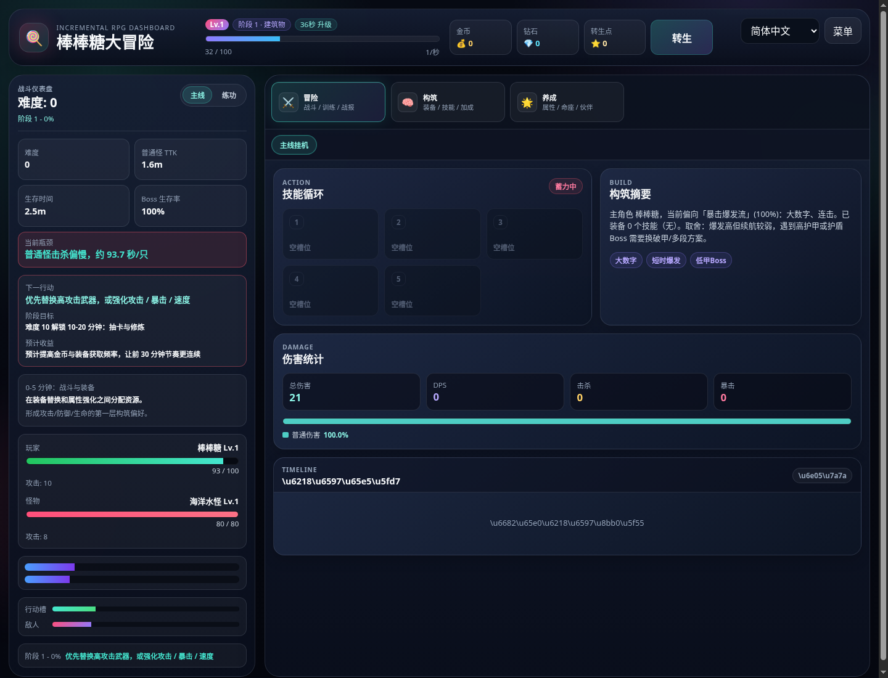
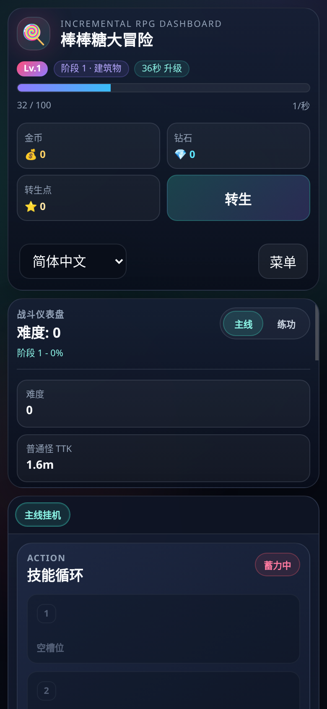

# 棒棒糖大冒险 (Lollipop Adventure)

一款基于难度值驱动的放置类 RPG 游戏。击败怪物、收集装备、不断提升，冲击更高的难度记录。

---

## 游戏入口

```
npm install
npm run dev
```

游戏启动后访问 `http://localhost:5173`

开发环境如需自动注入快速测试脚本，可使用 `http://localhost:5173/?quickTest=1`。

## 部署到 Vercel

这个项目是标准 Vite 静态前端，已提供 [`vercel.json`](./vercel.json)。

在 Vercel 中导入仓库后，使用以下配置即可：

```
Install Command: npm install
Build Command: npm run build
Output Directory: dist
```

如果不手动填写，Vercel 也会从仓库中的 `vercel.json` 读取相同配置。

## 部署到腾讯云服务器的子路径

如果你想把博客放在 `https://pearllover.site/`，把游戏放在 `https://pearllover.site/game/`，这个项目现在可以直接按子路径构建。

构建命令：

```bash
VITE_BASE_PATH=/game/ npm run build
```

构建完成后，把 `dist/` 目录上传到服务器，例如：

```bash
/www/wwwroot/pearllover.site/game/
```

如果你使用 Nginx，站点配置可以按这个思路处理：

```nginx
server {
    server_name pearllover.site www.pearllover.site;
    root /www/wwwroot/pearllover.site/blog;
    index index.html;

    location / {
        try_files $uri $uri/ /index.html;
    }

    location /game/ {
        alias /www/wwwroot/pearllover.site/game/;
        try_files $uri $uri/ /game/index.html;
    }
}
```

说明：
- `/` 继续给你的博客使用。
- `/game/` 指向这个项目构建后的静态文件目录。
- 以后每次更新游戏，只需要重新执行 `VITE_BASE_PATH=/game/ npm run build`，然后覆盖服务器上的 `game/` 目录。

---

## 核心系统

### 战斗与推图
击败不断变强的怪物，累积难度值（Difficulty Value）。难度值越高，遇到的怪物越强，但掉落也越丰富。

### 30 分钟主线
前期体验收束为少量核心系统，避免一开始横向铺开：

| 阶段 | 玩家体验目标 | 系统 |
|---|---|---|
| 0-5 分钟 | 明白攻击、掉落、装备 | 战斗 + 装备 |
| 5-10 分钟 | 第一次 Boss 压力 | Boss + 属性强化 |
| 10-20 分钟 | 获得长期目标 | 抽卡 + 修炼 |
| 20-30 分钟 | 开始形成构筑 | 技能 + 套装 + 装备比较 |

主界面会常驻显示下一目标、当前瓶颈、推荐行动与预计收益，例如 Boss 生存率不足时优先提示生命、防御或吸血词条。

### 五大流派
每个流派都有核心属性、代表词条、代表套装、代表技能、克制/弱点 Boss 与 UI 标签：

| 流派 | 核心取舍 | 克制 | 弱点 |
|---|---|---|---|
| 暴击爆发 | 大数字、短时爆发，续航较弱 | 狂暴 / 汲血 Boss | 高护甲 / 护盾 Boss |
| 吸血坦克 | 生命、防御、吸血，击杀较慢 | 狂暴 / 护盾 Boss | 汲血 / 高护甲 Boss |
| 破甲真伤 | 穿透、真伤、虚空伤害，稳定打高防 | 高护甲 Boss | 高闪避 / 狂暴 Boss |
| 极速技能 | 速度、冷却、技能增伤，多段循环 | 护盾 / 高闪避 Boss | 高护甲 / 汲血 Boss |
| 幸运寻宝 | 掉落和金币更高，但战斗偏弱 | 资源循环 | 狂暴 / 高护甲 / 护盾 Boss |

### 装备系统
击败怪物概率掉落装备，装备等级 = 击杀怪物的难度值。
- **8 级稀有度**：common → good → fine → epic → legend → myth → ancient → eternal
- **平滑稀有度倍率**：common 1x → eternal 21x，主要差异来自词条数量、套装、可升级词条与特效
- **12 个装备槽位**：武器、头盔、衣服、护腿、鞋子、护符、戒指 x2、项链、披风、护肩、护腕
- 装备属性分为可升级（攻击/防御/生命/速度）和不可升级（暴击/穿透/闪避等）

### 命座与觉醒（ Cultivation）
收集同名角色碎片激活命座星级，提升基础属性。满星后可觉醒，解锁被动技能。

### 抽卡系统
- **常驻池**：随时可抽，当前 280 钻/抽，90 抽保底
- **限定池**：定时刷新，当前 280 钻/抽，90 抽保底 + 80 抽软保底
- **每日免费**：不扣钻，但仍推进保底和抽卡历史


### 平衡报告与数值护栏
不要维护手写静态平衡表，使用源码直接生成：

```bash
npm run balance-report
```

报告默认输出到 `reports/balance-report.md`，覆盖难度、构筑、场景、胜率、平均 TTK/TTL、死亡率、金币/分钟、装备/分钟，并附带护栏状态、主要失败原因与推荐关注属性。`balance-report` 只负责观察，即使出现 `fail` 也不会阻断。

需要在 CI 或改数值公式后做强检查时运行：

```bash
npm run balance-check
```

`balance-check` 复用同一份报告逻辑；当护栏存在 `fail` 时以非零状态退出。

### 被动技能
装备可附带条件触发型被动技能，如「生命低于 30% 时攻击力+15%」「击杀后恢复 5% 生命」等。

### 每日挑战
- **每日boss**：每天 3 个 boss，击败获高额奖励
- **每周boss**：每周 5 个 boss，奖励更丰厚

### 战令与赛季
- 战令分免费/付费档，50 级解锁全部奖励
- 赛季任务独立于战令，完成获赛季代币

### 装备套装
集齐 2/3/5 件套装装备触发额外效果，当前包含 5 套装备套装。

---

## 难度与怪物

怪物属性随难度值指数增长：
- HP / 攻击 / 防御：`10 × 1.15^(difficulty/10)`
- 暴击率：基础 5%，随难度提升，上限 80%
- 暴击伤害：基础 150%，随难度提升

---

## 属性简介

| 类型 | 属性 |
|------|------|
| 基础 | 攻击、防御、生命、速度 |
| 进阶 | 暴击率、暴击伤害、穿透、闪避、必中、暴击抵抗 |
| 高级 | 幸运、虚空伤害、真实伤害、连击、增伤区 |
| 终极 | 时间扭曲、质量崩塌、维度撕裂 |

---

## 游戏截图

以下截图来自 `feature/ui-redesign` 分支的快速测试数据，用于记录本轮工作台式 UI 重构后的桌面端和移动端布局。

### 桌面工作台



### 移动端布局



---

## 更新日志

见 [CHANGELOG.md](./CHANGELOG.md)
